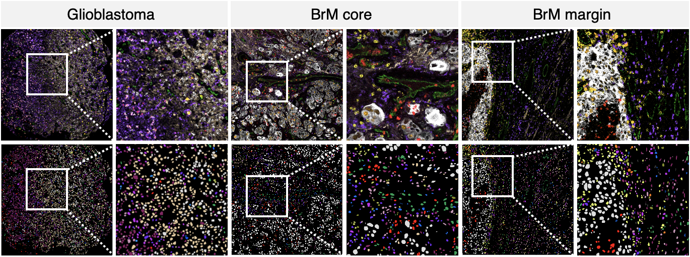

# IMC-Brain
# Single-cell spatial immune landscapes of primary and metastatic brain tumors

This repository includes codes and data used in the "Single-cell spatial immune landscapes of primary and metastatic brain tumors" paper.

## Summary
The emergence of single cell technologies in recent years has enabled characterization of the
tumor microenvironment at unprecedented depth and has highlighted an incredible degree of
cellular diversity amongst tumor cells and their niche. Anti-tumor immunity relies on coordinated
spatially defined cell-cell relationships within the tumor microenvironment 1,2 , yet many single cell
studies lack spatial context by sequencing dissociated tissues 3 . This has become increasingly
critical for tumor types that are highly influenced by unique immune niches, such as the myeloid-
rich lymphoid-cold microenvironment of brain tumors 4 . Here we apply imaging mass cytometry
to characterize the immunological landscape of 140 glioblastoma and 46 brain metastasis
patient tumor samples, with clinical data available for all patients. Single cell analysis of over
1.1M cells across 389 high-dimensional histopathology images enabled spatial resolution of
immune lineages and activation states, revealing differences in immune landscapes between
primary glioblastoma and brain metastases from diverse solid cancers. These analyses also
identified cellular neighbourhoods associated with survival in patients with glioblastoma, which
were leveraged to identify a unique population of recruited MPO+ macrophages that had an
unexpected association with long-term survival. Our findings add depth towards understanding
the putative regulatory impact of monocyte-derived macrophages and tissue-resident microglia
on brain tumor progression and build context around how these cell types interact with their
niche. Our study serves as a new resource for primary brain tumors and metastases, reinforcing
the value of integrating spatial resolution into single cell datasets to improve our understanding
of the microenvironmental contexture of cancer.

## List of repositories used in this project

You can find the detail of each analysis in the following repositories. 

* [Cell Segmentation](https://github.com/walsh-quail-labs/Cell-Segmentation)
* [Cell phenotyping](https://github.com/walsh-quail-labs/Cell-Phenotyping-Brain)

## Data

Tif files including masks for each patient and used for cell type assignments. Segmentation and cell type assignment results are provided in their subfolders. 

